# DevControle

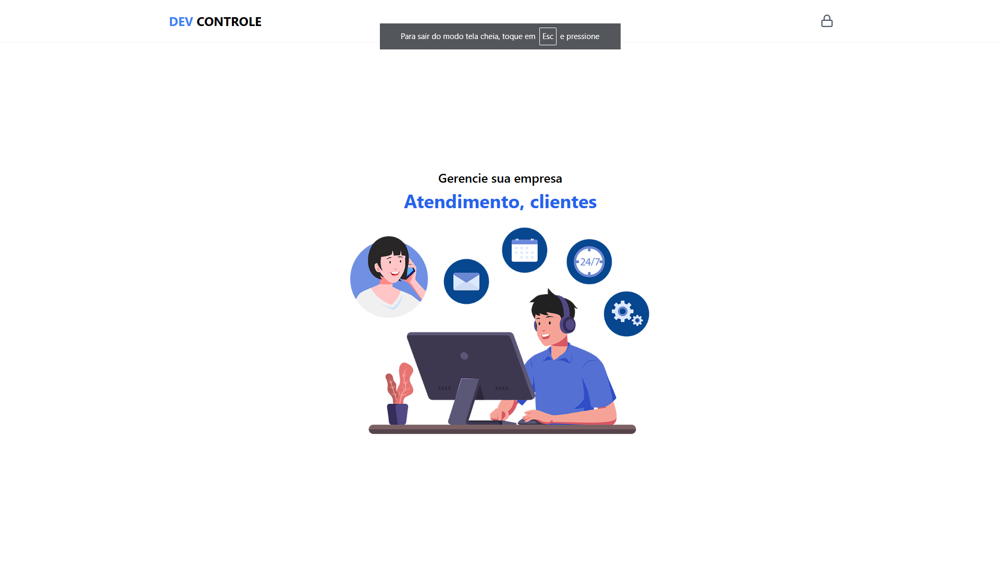

O **DevControle** é umaaplicação de nível profissional para cadastro de clientes, abertura e acompanhamento de chamados para processos internos e externos. Desenvolvido com _Next, Tailwind, e TypeScript_, o site utiliza API padrão RESTFUL, via _Next Routes, Prisma e MongoDB Atlas_ para gerenciamento de dados.
## Sumário

1. [Visão Geral do Projeto](#visão-geral-do-projeto-funcionalidades-principais)
   - [Login com conta do Google](#1-login-com-a-api-do-google)
   - [Cadastro e gerenciamento de clientes](#2-cadastro-e-gerenciamento-de-clientes)
   - [Registro e gerenciamento de chamados](#3-cadastro-e-gerenciamento-de-chamados)
   - [Abertura de chamados feito pelo cliente](#4-cadastro-de-chamados-feito-pelo-cliente)
2. [Tecnologias Utilizadas](#tecnologias-utilizadas-linguagens-e-ferramentas)
3. [Estrutura do Projeto](#estrutura-do-projeto)
5. [Screenshots](#screenshots)
   - [Iphone 14 pro max](#iphone-14-pro-max)
   - [Ipad pro](#ipad-pro)
   - [Mobile](#mobile)
   - [Desk](#desktop)
6. [Requisitos para Rodar o Projeto Localmente](#requisitos-para-rodar-o-projeto-localmente)
7. [Rodar o Projeto Localmente](#rodar-o-projeto-localmente)
8. [Autores](#autores)
9. [Licença](#licença)

## Visão Geral do Projeto (Funcionalidades Principais)

### 1. Login com a API do Google:

- O login e todo processo de autenticação é feito via autenticação da API do Google.

### 2. Cadastro e gerenciamento de clientes:

O cadastro e gerenciamento de seus clientes possuem tais dados e funcionalidades:
- **Nome**
- **Telefone**
- **Email**
- **Endereço**
- **Exclusão do cadastro**

### 3. Cadastro e gerenciamento de chamados:

O cadastro de chamados, que dependem de possuir um cliente, e gerenciamento possuem tais dados e funcionalidade:
- **Nome**
- **Descrição do problema**
- **Cliente selecionado**
- **Detalhes do chamado**
- **Conclusão do chamado**

### 4. Cadastro de chamados feito pelo cliente:

O cadastro de chamados feito pelo cliente, que não necessita estar autenticado para isso, possuem tais dados e funcionalidade:
- **Nome do chamado**
- **Cliente selecionado**
- **Detalhes do chamado**
- **Pesquisa do cliente via email**

## Tecnologias Utilizadas (Linguagens e ferramentas)

<table>
    <tr>
      <td align="center">
        <a href="https://nextjs.org/">
          
          <br />
          <sub>
            <b>Next.JS</b>
          </sub>
        </a>
      </td>
      <td align="center">
        <a href="https://tailwindcss.com/">
          
          <br />
          <sub>
            <b>Tailwind CSS</b>
          </sub>
        </a>
      </td>
      <td align="center">
        <a href="https://www.typescriptlang.org/">
          
          <br />
          <sub>
            <b>TypeScript</b>
          </sub>
        </a>
      </td>
    </tr>
</table>
<table border-style="none">
  <tr>
    <td align="center">
      <a href="https://www.mongodb.com/products/platform/atlas-database">
        <br />
        <sub>
          <b>MongoDB</b>
        </sub>
      </a>
    </td>
    <td align="center">
      <a href="https://www.prisma.io/?via=start&gad_source=1&gclid=CjwKCAiAh6y9BhBREiwApBLHC9l2TMrWhYJPi787DeRP5SCnQp6MnosFLDKIvTfWJ9IoUl684SdROhoCrTUQAvD_BwE">
        <br />
        <sub>
          <b>Prisma</b>
        </sub>
      </a>
    </td>
    <td align="center">
      <a href="https://git-scm.com/">
        <br />
        <sub>
          <b>Git</b>
        </sub>
      </a>
    </td>
    <td align="center">
      <a href="https://github.com/">
        
        <br />
        <sub margin-top="50px;">
          <b>Github</b>
        </sub>
      </a>
    </td>
  </tr>
</table>

## Estrutura do Projeto

O projeto é organizado em vários arquivos para melhor organização do código e separação de interesses:

- `public/`: A pasta serve como o local para armazenar arquivos estáticos que não passam pelo processo de build do React e podem ser acessados diretamente no navegador.
- `src/`: Onde encontra-se o processo de desenvolvimento de todo o código-fonte do sistema.
- `app/`: A pasta contém todo o sistema de rotas e páginas do projeto.
- `components/`: A pasta contém todos os componentes utilizados na aplicação.
- `lib/`: A pasta contém toda a estrutura de configurações para as "libs" utilizadas.
- `utils/`: A pasta contém toda lógica que é compartilhada e utiliza em todo código.
- `providers/`: Onde encontra-se os providers utilizados na aplicação.

## Screenshots

### Iphone 14 pro max

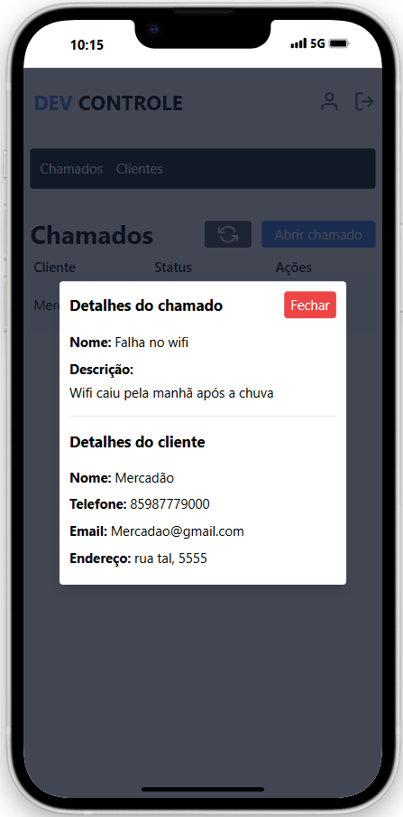

### Ipad pro

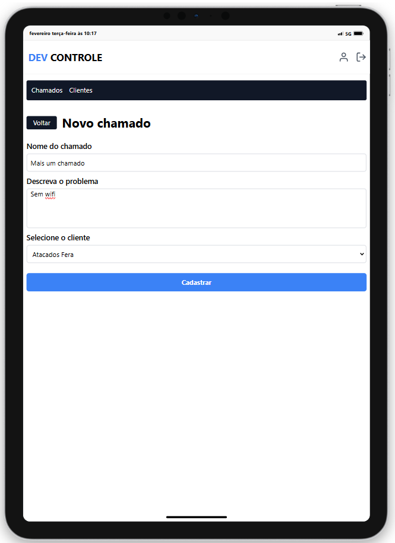

### Mobile

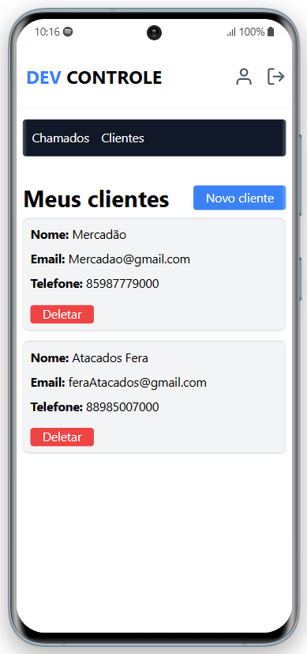

### Desktop


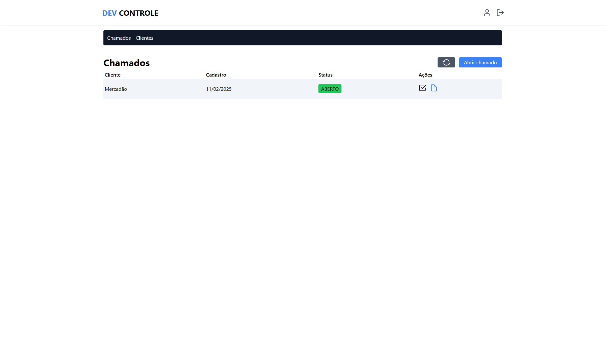
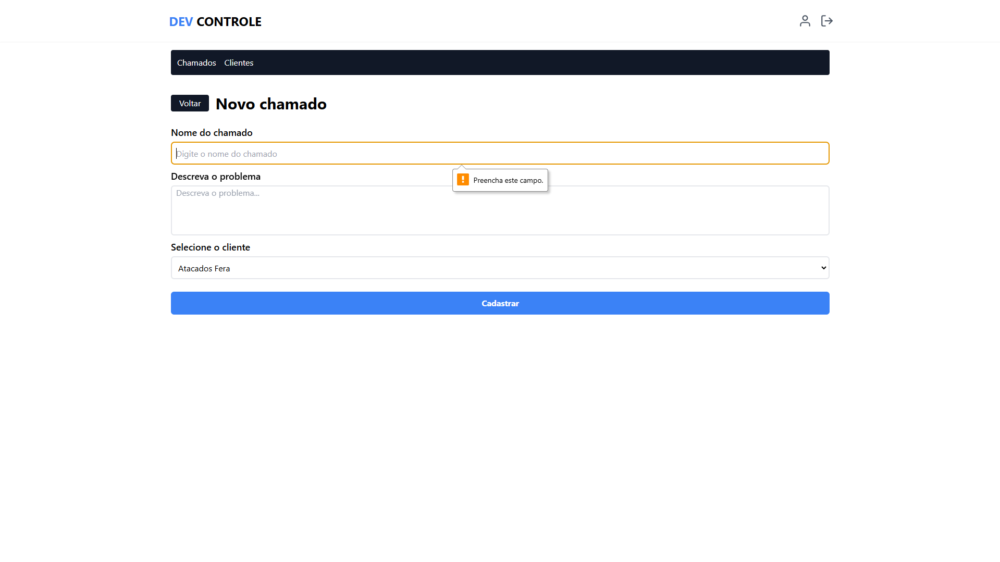
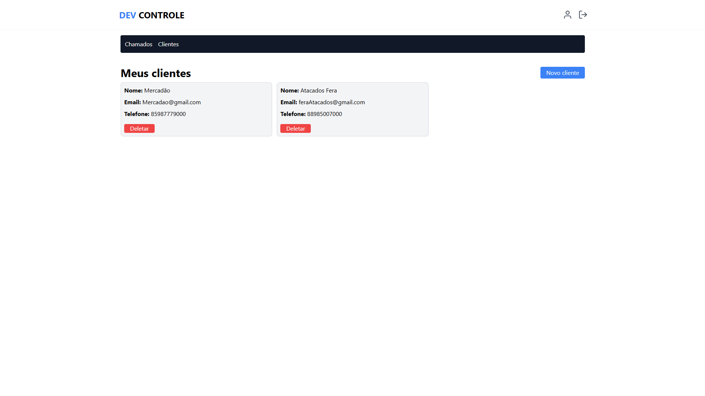
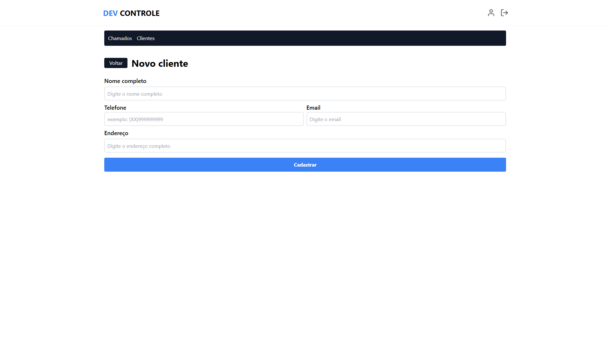
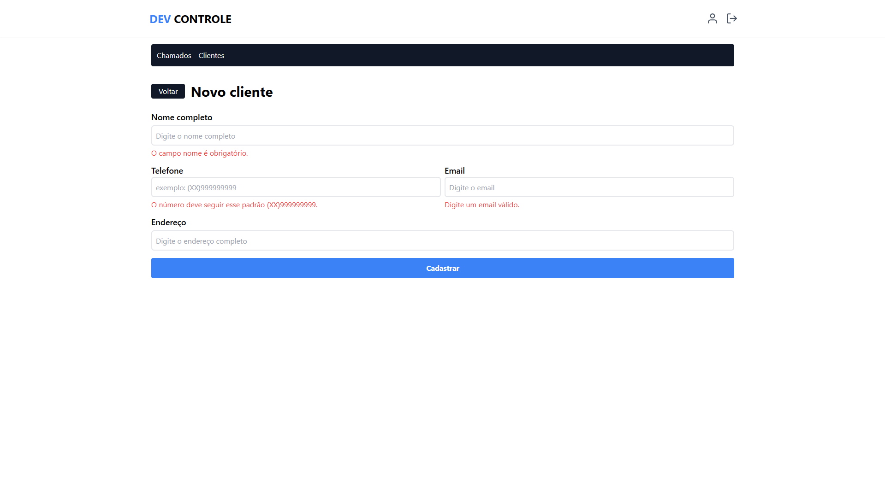
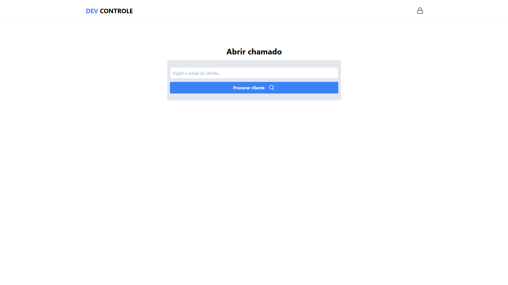
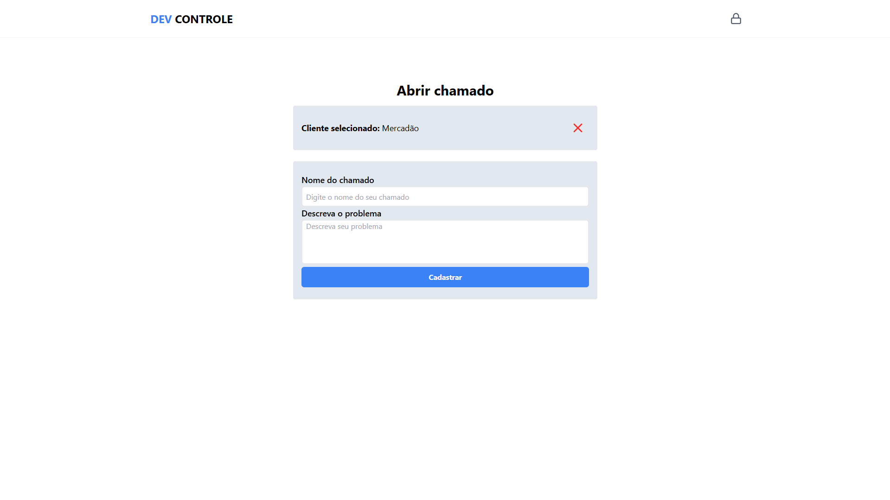

## Requisitos para Rodar o Projeto Localmente

### Node.js e npm:

- Verifique se você tem o Node.js instalado. Caso contrário, faça o download e instale a versão mais recente do Node.js.
- O npm (Node Package Manager) é instalado automaticamente com o Node.js.

### Git:

- Certifique-se de ter o Git instalado em sua máquina. Se não tiver, você pode baixá-lo aqui.

### Editor de Texto ou IDE:

- Escolha um editor de texto ou uma IDE (Ambiente de Desenvolvimento Integrado) para trabalhar no código. Alguns exemplos populares incluem o Visual Studio Code, Sublime Text e Atom.

### Navegador Web:

- Você precisará de um navegador web para visualizar o aplicativo localmente. Recomendamos o uso do Google Chrome, Mozilla Firefox ou Microsoft Edge.

### Configuração do Prisma e MongoDB:

- Necessita realizar toda a configuração do Prisma e MongoDB.

## Rodar o Projeto Localmente

**Clone o projeto**

```bash
  git clone https://github.com/MarcioJorgeMelo/DevControle.git
```

**Vá para a pasta do projeto**

```bash
  cd devcontrole
```

**Abra o projeto no VSCode**

```bash
  code .
```

**Instale as dependências**

```bash
  npm install # Instala as dependências (se ainda não tiver feito)
```

**Abra com o React Server**

```bash
  npm run dev # Inicia o servidor NextJS
```

## Autores

- [@MarcioJorgeMelo](https://github.com/MarcioJorgeMelo)

## Licença

- [MIT](https://choosealicense.com/licenses/mit/)
